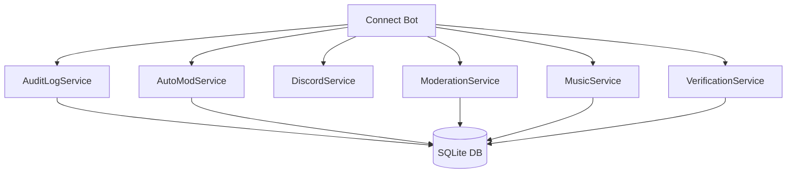

<div align="center">

<!-- Animated Header -->


<!-- Animated Typing -->
<a href="https://github.com/AncientVipers/Connect-Bot">
  
</a>

<br/>

<!-- Badges -->
[](https://discord.js.org/)
[](https://www.typescriptlang.org/)
[](https://nodejs.org/)
[](https://www.sqlite.org/)

[](https://github.com/AncientVipers/Connect-Bot/stargazers)
[](LICENSE)
[](https://github.com/AncientVipers/Connect-Bot)

<br/>

<!-- Quick Links -->
[📖 Documentation](#-table-of-contents) • [🚀 Quick Start](#-quick-start) • [💬 Commands](#-commands-38-total) • [📋 Logging](#-logging-system) • [🤝 Contributing](#-contributing)

</div>

---

<br/>

## 📑 Table of Contents

<details open>
<summary><b>Click to expand/collapse</b></summary>

- [✨ Features](#-features)
- [🚀 Quick Start](#-quick-start)
- [📁 Project Structure](#-project-structure)
- [💬 Commands (38 Total)](#-commands-38-total)
  - [🛡️ Moderation Commands](#️-moderation-commands-8)
  - [🎵 Music Commands](#-music-commands-19)
  - [🔧 Utility Commands](#-utility-commands-5)
  - [🎮 Valorant Commands](#-valorant-commands-6)
- [📡 Events](#-events-handled-24)
- [📋 Logging System](#-logging-system)
- [🔢 Event IDs](#-event-id-reference)
- [⚙️ Services](#️-core-services)
- [🗄️ Database](#️-database)
- [🔐 Security](#-security)
- [🤝 Contributing](#-contributing)
- [📜 License](#-license)

</details>

<br/>

---

## ✨ Features

<div align="center">

| Feature | Description |
|:-------:|:------------|
| 🎵 **Music System** | Play from YouTube, Spotify, SoundCloud with filters, DJ roles & vote skip |
| 🛡️ **Moderation** | Warn, mute, kick, ban with full logging and permission hierarchy |
| 🤖 **AutoMod** | Spam detection, invite blocking, anti-raid with lockdown mode |
| ✅ **Verification** | CAPTCHA system with multiple challenge types |
| 📋 **Logging** | 12 dedicated log channels with searchable event IDs |
| 🎮 **Valorant** | Check your daily store, night market, and VP balance |
| 🔒 **Security** | AES-256-GCM encryption for sensitive data |

</div>

<br/>

<details>
<summary><b>🎵 Music Features</b></summary>

<br/>

```
✅ Multi-Platform Support     → YouTube, Spotify, SoundCloud, Radio Streams
✅ Smart Search               → Autocomplete with cross-platform results  
✅ Audio Filters              → 22 filters including Bass Boost, Nightcore, Vaporwave
✅ DJ System                  → Designated DJ roles with elevated permissions
✅ Vote Skip                  → Democratic skipping for non-DJ members
✅ Queue Management           → Add, remove, shuffle, loop, clear
✅ Lyrics                     → Fetch and DM lyrics to users
✅ Now Playing                → Rich embeds with progress bars
```

</details>

<details>
<summary><b>🛡️ Moderation Features</b></summary>

<br/>

```
✅ Warning System             → Unique IDs, history tracking, removal
✅ Timed Mutes                → Preset durations from 10m to permanent
✅ User Investigation         → Deep dive into suspicious accounts
✅ Permission Hierarchy       → Can't moderate users with higher roles
✅ AutoMod                    → Spam, invites, raid protection
✅ Server Lockdown            → Emergency lockdown mode
✅ Exemptions                 → Role and channel exemptions
✅ Full Logging               → Every action logged with details
```

</details>

<details>
<summary><b>📋 Logging Features</b></summary>

<br/>

```
✅ 12 Dedicated Channels      → Organized by event category
✅ Event IDs                  → Unique IDs (1-114) for filtering
✅ Searchable Format          → Text-based search in embeds
✅ Rich Embeds                → Color-coded by event type
✅ Audit Log Integration      → Fetch who performed actions
✅ Staff-Only Access          → Protected log channels
```

</details>

<br/>

---

## 🚀 Quick Start

### Prerequisites

```bash
# Required
Node.js >= 18.0.0
npm or yarn

# Optional (for full functionality)
FFmpeg          # For audio processing
Spotify API     # For Spotify support
```

### Installation

```bash
# Clone the repository
git clone https://github.com/AncientVipers/Connect-Bot.git
cd Connect-Bot

# Install dependencies
npm install

# Configure environment
cp .env.example .env
# Edit .env with your tokens

# Build the bot
npm run build

# Start the bot
npm start
```

### Environment Variables

```env
# Required
DISCORD_TOKEN=your_discord_bot_token
CLIENT_ID=your_client_id
BOT_OWNER_ID=your_discord_user_id

# Optional
SPOTIFY_CLIENT_ID=your_spotify_client_id
SPOTIFY_CLIENT_SECRET=your_spotify_client_secret
ENCRYPTION_KEY=32_byte_hex_key_for_valorant
```

<br/>

---

## 📁 Project Structure

```
Connect-Bot/
├── 📂 src/
│   ├── 📂 commands/          # 38 Slash Commands
│   │   ├── 📂 moderation/    # 8 moderation commands
│   │   ├── 📂 music/         # 19 music commands
│   │   ├── 📂 utility/       # 5 utility commands
│   │   └── 📂 valorant/      # 6 valorant commands
│   │
│   ├── 📂 events/            # 24 Discord Event Handlers
│   ├── 📂 services/          # 6 Core Services
│   ├── 📂 database/          # SQLite Database
│   ├── 📂 utils/             # Utility Functions
│   ├── 📄 index.ts           # Entry Point
│   ├── 📄 config.ts          # Configuration
│   └── 📄 types.ts           # TypeScript Types
│
├── 📂 dist/                  # Compiled JavaScript
├── 📄 package.json
├── 📄 tsconfig.json
└── 📄 README.md
```

<br/>

---

## 💬 Commands (38 Total)

<div align="center">
  
  
  
  
</div>

<br/>

### 🛡️ Moderation Commands (8)

<details open>
<summary><b>View All Moderation Commands</b></summary>

<br/>

| Command | Description | Options | Permissions |
|:--------|:------------|:--------|:------------|
| `/purge` | Bulk delete messages | `amount` (1-100), `user` (optional) | Admin/Dev/Owner + ManageMessages |
| `/warn` | Issue a warning | `user`, `reason` | Staff Only |
| `/unwarn` | Remove a warning | `user`, `warning_id` | Staff Only |
| `/mute` | Temporarily mute user | `user`, `duration`, `reason` | Staff Only |
| `/unmute` | Remove mute | `user`, `reason` | Staff Only |
| `/kick` | Kick from server | `user`, `reason` | Staff Only |
| `/checkuser` | Investigate user | `user` | Moderator+ |
| `/automod` | Configure AutoMod | *Subcommands below* | Owner/Dev Only |

<br/>

#### 📋 `/automod` Subcommands

| Subcommand | Description |
|:-----------|:------------|
| `/automod status` | View current AutoMod configuration |
| `/automod spam <enabled>` | Toggle spam detection |
| `/automod invites <enabled>` | Toggle invite link blocking |
| `/automod raid <enabled>` | Toggle anti-raid protection |
| `/automod lockdown <enabled> [reason]` | Enable/disable lockdown |
| `/automod exempt-role <role> <add\|remove>` | Manage role exemptions |
| `/automod exempt-channel <channel> <add\|remove>` | Manage channel exemptions |

<br/>

#### 🔍 `/checkuser` Investigation Details

```
📊 Account Analysis:
├── 🔴 VERY NEW ACCOUNT (< 1 day)
├── 🟠 New Account (< 7 days)  
├── 🟡 Relatively New (< 30 days)
├── ⚠️ Suspicious username patterns
├── ⚠️ No avatar / No banner flags
├── ⚠️ Quick join after account creation
│
📋 Information Displayed:
├── Account age (days/hours)
├── Join date & membership duration
├── All roles & highest role
├── Nickname & boost status
├── Warning history
└── Mute history
```

</details>

<br/>

### 🎵 Music Commands (19)

<details open>
<summary><b>View All Music Commands</b></summary>

<br/>

| Command | Description | Options | Cooldown |
|:--------|:------------|:--------|:---------|
| `/play` | Play a song/playlist/stream | `query` (name or URL) | 3s |
| `/pause` | Pause playback | - | 2s |
| `/resume` | Resume playback | - | 2s |
| `/skip` | Skip current song | - | 2s |
| `/stop` | Stop and clear queue | - | 3s |
| `/queue` | View queue | `page` (optional) | 3s |
| `/nowplaying` | Current song info | - | 3s |
| `/volume` | Set volume | `level` (1-100) | 3s |
| `/seek` | Skip/rewind in song | `seconds` (-300 to 300) | 2s |
| `/shuffle` | Shuffle queue | - | 3s |
| `/loop` | Set loop mode | `mode` (Off/Song/Queue) | 3s |
| `/remove` | Remove from queue | `position` | 3s |
| `/clearqueue` | Clear entire queue | - | 3s |
| `/disconnect` | Leave voice channel | - | 3s |
| `/lyrics` | Get lyrics (via DM) | - | 10s |
| `/filter` | Toggle audio filter | `name` | 3s |
| `/clearfilter` | Remove all filters | - | 3s |
| `/adddj` | Add DJ role | `role` | 5s |
| `/removedj` | Remove DJ role | `role` | 5s |

<br/>

#### 🎚️ Available Audio Filters

<div align="center">

| Built-in Filters | Custom Filters |
|:-----------------|:---------------|
| 🔊 Bass Boost | 🎸 Bass |
| 🌀 3D Audio | 🎵 Treble |
| 🐿️ Nightcore | 🐿️ Chipmunk |
| 🎭 Vaporwave | 👹 Darth Vader |
| 🎤 Karaoke | 🐌 Slow |
| 🔄 Reverse | ⚡ Fast |
| 🎚️ Echo | 〰️ Vibrato |
| 📢 Flanger | 🎹 Chorus |
| 🚪 Gate | |
| 📻 Haas | |
| 🔁 Phaser | |
| 🔇 Mcompand | |
| 🎵 Tremolo | |
| 🔊 Surround | |

</div>

<br/>

#### 🎧 DJ System

```
👑 DJ Abilities:
├── ⏭️ Skip songs directly (no vote)
├── 🔀 Shuffle the queue
├── 🗑️ Clear the queue
└── 🎚️ Use audio filters

🗳️ Non-DJ Members:
└── Can start vote skip (majority needed)
```

</details>

<br/>

### 🔧 Utility Commands (5)

<details open>
<summary><b>View All Utility Commands</b></summary>

<br/>

| Command | Description | Options | Permissions |
|:--------|:------------|:--------|:------------|
| `/botusage` | View bot usage statistics | - | Administrator |
| `/help` | Show all commands | `category` (optional) | Everyone |
| `/ping` | Check bot latency | - | Everyone |
| `/rebuild` | Rebuild server structure | - | **BOT OWNER ONLY** |
| `/testdevlog` | Test dev-logs channel | `type`, `message` (optional) | **Owner/Developer Role** |

<br/>

#### ⚠️ `/rebuild` Warning

> **This command will completely rebuild the server!**
> 
> **Deleted:**
> - All channels
> - All categories  
> - All roles (except @everyone and managed)
>
> **Created:**
> - New role hierarchy (Owner → Unverified)
> - Verification channel with CAPTCHA
> - All categories & channels
> - Proper permissions
>
> *Requires confirmation with 30s timeout*

</details>

<br/>

### 🎮 Valorant Commands (6)

<details open>
<summary><b>View All Valorant Commands</b></summary>

<br/>

| Command | Description | Cooldown | DM Support |
|:--------|:------------|:---------|:-----------|
| `/valregister` | Link your Riot account | 30s | ✅ |
| `/valunregister` | Remove your account | 10s | ✅ |
| `/valaccount` | View account info | 5s | ✅ |
| `/valstore` | Check daily store | 30s | ✅ |
| `/valnightmarket` | Check night market | 30s | ✅ |
| `/valbalance` | Check VP/RP balance | 30s | ✅ |

<br/>

#### 🔗 Registration Process

```
1️⃣ Use /valregister
2️⃣ Select your region (NA, EU, AP, KR)
3️⃣ Click "Login with Riot" button
4️⃣ Open DevTools (F12) → Application → Cookies
5️⃣ Find 'ssid' cookie and copy value
6️⃣ Click "Paste Cookie" and submit

🔒 Your credentials are encrypted with AES-256-GCM
```

<br/>

#### 💰 `/valbalance` Display

```
💎 Valorant Points (VP)    → For skins
✨ Radianite Points (RP)   → For upgrades
🎖️ Kingdom Credits (KC)    → Free currency
```

</details>

<br/>

---

## 📡 Events Handled (24)

<div align="center">

| Event | Channel | Description |
|:------|:--------|:------------|
| `ready` | dev-logs | Bot startup |
| `interactionCreate` | command-logs | Command execution |
| `messageCreate` | - | AutoMod processing |
| `messageUpdate` | message-logs | Message edited |
| `messageDelete` | message-logs | Message deleted |
| `messageReactionAdd` | message-logs | Reaction added to message |
| `messageReactionRemove` | message-logs | Reaction removed from message |
| `messageReactionRemoveAll` | message-logs | All reactions cleared |
| `guildMemberAdd` | member-logs | User joined |
| `guildMemberRemove` | member-logs | User left/kicked/banned |
| `guildMemberUpdate` | member-logs | Role/nickname changed |
| `voiceStateUpdate` | voice-logs | Voice activity |
| `presenceUpdate` | user-logs | Status changed |
| `userUpdate` | user-logs | Profile changed |
| `channelCreate` | channel-logs | Channel created |
| `channelDelete` | channel-logs | Channel deleted |
| `channelUpdate` | channel-logs | Channel modified |
| `roleCreate` | role-logs | Role created |
| `roleDelete` | role-logs | Role deleted |
| `roleUpdate` | role-logs | Role modified |
| `emojiCreate` | server-logs | Server emoji created |
| `emojiDelete` | server-logs | Server emoji deleted |
| `emojiUpdate` | server-logs | Server emoji modified |
| `guildUpdate` | server-logs | Server settings changed |

</div>

<br/>

---

## 📋 Logging System

### 12 Dedicated Log Channels

All channels are created automatically under the **📋 Logging** category with staff-only permissions.

<div align="center">

| Channel | Emoji | Purpose |
|:--------|:-----:|:--------|
| `member-logs` | 👥 | Joins, leaves, updates, boosts |
| `message-logs` | 💬 | Edits, deletes, bulk deletes |
| `voice-logs` | 🎙️ | Joins, leaves, moves, mute/deafen |
| `user-logs` | 👤 | Profile updates, presence changes |
| `command-logs` | ⚡ | All command executions |
| `moderation-logs` | 🔨 | Warns, mutes, kicks, bans, purges |
| `verification-logs` | ✅ | CAPTCHA success/failure |
| `raid-logs` | 🚨 | Anti-raid events, suspicious joins |
| `channel-logs` | 📁 | Channel create/delete/update |
| `role-logs` | 🎭 | Role create/delete/update |
| `server-logs` | ⚙️ | Server setting changes |
| `dev-logs` | 🔧 | Errors, startup, shutdown, crashes |

</div>

<br/>

### Log Entry Format

Each log entry includes:

```
┌─────────────────────────────────────────────┐
│  📋 [COLORED EMBED]                         │
├─────────────────────────────────────────────┤
│  Title: Event Description                    │
│  Fields: Detailed Information               │
│                                             │
│  ──────────────────────────────────         │
│  🔍 Searchable Text Format:                 │
│  [TYPE] [ID] FIELD: VALUE                   │
│  [TYPE] [ID] FIELD: VALUE                   │
│                                             │
├─────────────────────────────────────────────┤
│  Footer: Event ID: XX • Event Name • ID     │
│  Timestamp: 2024-01-30T12:00:00Z            │
└─────────────────────────────────────────────┘
```

<br/>

---

## 🔢 Event ID Reference

All events have unique IDs for easy filtering and searching.

<details open>
<summary><b>📊 Complete Event ID Table</b></summary>

<br/>

### Member Events (1-9)

| ID | Constant | Description |
|:--:|:---------|:------------|
| 1 | `MEMBER_JOIN` | User joined the server |
| 2 | `MEMBER_LEAVE` | User left/kicked/banned |
| 3 | `MEMBER_UPDATE` | Role or nickname changed |
| 4 | `MEMBER_BOOST` | Started boosting server |

### Message Events (10-19)

| ID | Constant | Description |
|:--:|:---------|:------------|
| 10 | `MESSAGE_EDIT` | Message was edited |
| 11 | `MESSAGE_DELETE` | Message was deleted |
| 12 | `MESSAGE_BULK_DELETE` | Multiple messages deleted |

### Voice Events (20-29)

| ID | Constant | Description |
|:--:|:---------|:------------|
| 20 | `VOICE_JOIN` | Joined voice channel |
| 21 | `VOICE_LEAVE` | Left voice channel |
| 22 | `VOICE_MOVE` | Moved between channels |
| 23 | `VOICE_STATE_CHANGE` | Generic state change |
| 24 | `SERVER_MUTE` | Server muted by staff |
| 25 | `SERVER_UNMUTE` | Server unmuted |
| 26 | `SERVER_DEAFEN` | Server deafened by staff |
| 27 | `SERVER_UNDEAFEN` | Server undeafened |

### User Events (30-39)

| ID | Constant | Description |
|:--:|:---------|:------------|
| 30 | `USER_UPDATE` | Username/avatar/banner changed |
| 31 | `PRESENCE_UPDATE` | Status or activity changed |

### Command Events (40-49)

| ID | Constant | Description |
|:--:|:---------|:------------|
| 40 | `COMMAND_EXECUTED` | Slash command used |

### Moderation Events (50-59)

| ID | Constant | Description |
|:--:|:---------|:------------|
| 50 | `MOD_WARN` | Warning issued |
| 51 | `MOD_MUTE` | User muted |
| 52 | `MOD_UNMUTE` | User unmuted |
| 53 | `MOD_KICK` | User kicked |
| 54 | `MOD_BAN` | User banned |
| 55 | `MOD_UNBAN` | User unbanned |
| 56 | `MOD_PURGE` | Messages purged |
| 57 | `AUTOMOD_SPAM` | Spam detected & blocked |
| 58 | `AUTOMOD_INVITE` | Invite link blocked |

### Verification Events (60-69)

| ID | Constant | Description |
|:--:|:---------|:------------|
| 60 | `VERIFICATION_SUCCESS` | CAPTCHA passed |
| 61 | `VERIFICATION_FAILED` | CAPTCHA failed |

### Anti-Raid Events (70-79)

| ID | Constant | Description |
|:--:|:---------|:------------|
| 70 | `RAID_SUSPICIOUS_JOIN` | Suspicious join detected |
| 71 | `RAID_ACCOUNT_AGE` | Account too new |
| 72 | `RAID_SIMILAR_USERNAME` | Similar username pattern |
| 73 | `RAID_JOIN_RATE` | High join rate detected |
| 74 | `RAID_MASS_MENTION` | Mass mention detected |
| 75 | `RAID_LOCKDOWN` | Lockdown activated |

### Channel Events (80-89)

| ID | Constant | Description |
|:--:|:---------|:------------|
| 80 | `CHANNEL_CREATE` | Channel created |
| 81 | `CHANNEL_DELETE` | Channel deleted |
| 82 | `CHANNEL_UPDATE` | Channel modified |

### Role Events (90-99)

| ID | Constant | Description |
|:--:|:---------|:------------|
| 90 | `ROLE_CREATE` | Role created |
| 91 | `ROLE_DELETE` | Role deleted |
| 92 | `ROLE_UPDATE` | Role modified |

### Server Events (100-109)

| ID | Constant | Description |
|:--:|:---------|:------------|
| 100 | `SERVER_UPDATE` | Server settings changed |

### Dev Events (110-119)

| ID | Constant | Description |
|:--:|:---------|:------------|
| 110 | `DEV_STARTUP` | Bot started successfully |
| 111 | `DEV_SHUTDOWN` | Bot shutting down |
| 112 | `DEV_ERROR` | Error occurred |
| 113 | `DEV_CRASH` | Critical crash |
| 114 | `DEV_WARNING` | Warning logged |

</details>

<br/>

---

## ⚙️ Core Services

<div align="center">



</div>

<br/>

| Service | Lines | Description |
|:--------|:-----:|:------------|
| **AuditLogService** | 2015 | Central logging with 12 channels, event IDs, searchable format |
| **AutoModService** | ~450 | Spam detection, invite blocking, anti-raid, lockdown |
| **DiscordService** | ~400 | Server structure, roles, channels, permissions |
| **ModerationService** | ~600 | Warnings, mutes, kicks, permission checks |
| **MusicService** | ~1200 | DisTube wrapper, queue, filters, DJ system |
| **VerificationService** | ~500 | CAPTCHA generation, verification flow |

<br/>

---

## 🗄️ Database

Connect Bot uses **SQLite** via `better-sqlite3` for persistence.

### Tables

```sql
-- Warnings
warnings (
    id INTEGER PRIMARY KEY,
    guildId TEXT,
    odId TEXT,
    moderatorId TEXT,
    reason TEXT,
    warningId INTEGER,
    timestamp INTEGER
)

-- Mutes
mutes (
    id INTEGER PRIMARY KEY,
    guildId TEXT,
    userId TEXT,
    expiresAt INTEGER,
    reason TEXT
)

-- AutoMod Settings
automod_settings (
    guildId TEXT PRIMARY KEY,
    enabled INTEGER,
    spamEnabled INTEGER,
    inviteEnabled INTEGER,
    raidEnabled INTEGER,
    exemptRoles TEXT,
    exemptChannels TEXT
)

-- DJ Roles
dj_roles (
    id INTEGER PRIMARY KEY,
    guildId TEXT,
    roleId TEXT
)

-- Valorant Accounts (Encrypted)
valorant_accounts (
    odId TEXT PRIMARY KEY,
    region TEXT,
    encryptedData TEXT,
    puuid TEXT,
    gameName TEXT,
    tagLine TEXT,
    lastLogin INTEGER
)
```

<br/>

---

## 🔐 Security

<div align="center">

| Feature | Implementation |
|:--------|:---------------|
| **Valorant Credentials** | AES-256-GCM encryption |
| **Environment Variables** | Sensitive data in `.env` |
| **Permission Checks** | Role hierarchy validation |
| **Rate Limiting** | Command cooldowns |
| **Staff-Only Logs** | Protected log channels |

</div>

<br/>

---

## 🛠️ Tech Stack

<div align="center">

| Technology | Purpose |
|:-----------|:--------|
|  | Runtime |
|  | Language |
|  | Discord API |
|  | Music |
|  | Database |
|  | Audio |

</div>

<br/>

---

## 🤝 Contributing

Contributions are welcome! Please feel free to submit a Pull Request.

1. Fork the repository
2. Create your feature branch (`git checkout -b feature/AmazingFeature`)
3. Commit your changes (`git commit -m 'Add some AmazingFeature'`)
4. Push to the branch (`git push origin feature/AmazingFeature`)
5. Open a Pull Request

<br/>

---

## 📜 License

This project is licensed under the MIT License - see the [LICENSE](LICENSE) file for details.

<br/>

---

<div align="center">

## 💖 Support

If you found this project helpful, please consider giving it a ⭐!

<br/>

[](https://star-history.com/#AncientVipers/Connect-Bot&Date)

<br/>

---


**Made with ❤️ by [AncientVipers](https://github.com/AncientVipers)**

</div>
